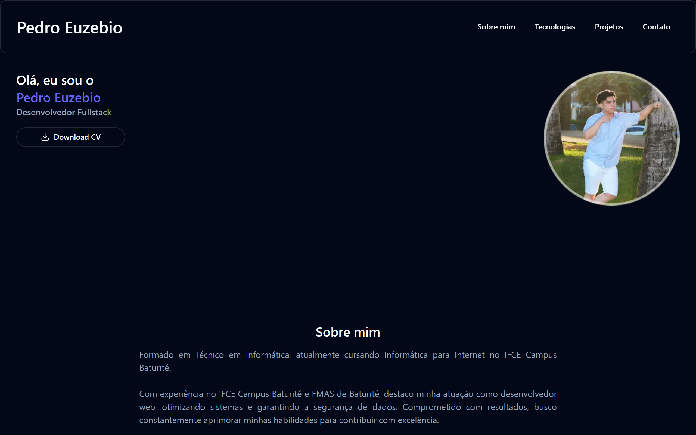

<h1 align="center">Portfólio</h1>

  <a href="#tecnologias">Tecnologias</a>&nbsp;&nbsp;&nbsp;|&nbsp;&nbsp;&nbsp;
  <a href="#projeto">Projeto</a>&nbsp;&nbsp;&nbsp;|&nbsp;&nbsp;&nbsp;
  <a href="#licenca">Licença</a>

  

  

## 🛠 Tecnologias

Esse projeto foi desenvolvido com as seguintes tecnologias:

- React
- Next.js
- Tailwind CSS
- Shadcn/UI
- AOS

## 💻 Projeto

Explore meu portfólio e conheça sobre mi, minhas tecnologias, projetos em destaque e como entrar em contato

- [Acesse o projeto, online](https://pedroeuzebio.vercel.app)

## 📝 Licença

Esse projeto está sob licença MIT. Veja o arquivo [LICENÇA](LICENSE.md) para mais detalhes.

---

Feito com ♥ by Pedro Euzebio